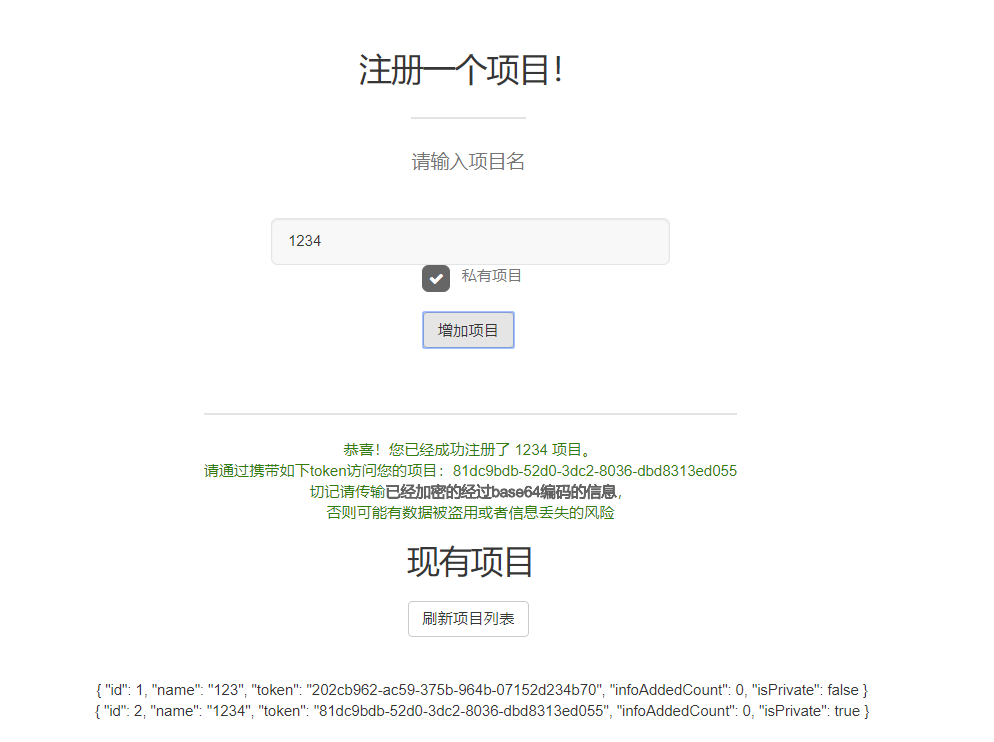

# ChainStore：一个基于区块链的分布式存储系统及可用于提供商业服务的管理系统

<!-- TOC -->

- [ChainStore：一个基于区块链的分布式存储系统及可用于提供商业服务的管理系统](#chainstore一个基于区块链的分布式存储系统及可用于提供商业服务的管理系统)
  - [摘要](#摘要)
  - [引言](#引言)
  - [1. 核心架构](#1-核心架构)
    - [1.1 工作原理简述](#11-工作原理简述)
    - [1.2 架构图](#12-架构图)
    - [1.3 各个部分介绍](#13-各个部分介绍)
      - [1.3.1 主机](#131-主机)
      - [1.3.2 存储](#132-存储)
      - [1.3.3 矿机](#133-矿机)
  - [2. 示例实现](#2-示例实现)
    - [2.1 实现简介](#21-实现简介)
    - [2.2 实现细节](#22-实现细节)
      - [2.2.1 MasterToken和AccessToken](#221-mastertoken和accesstoken)
      - [2.2.2 缓冲区](#222-缓冲区)
      - [2.2.3 初始化和注册](#223-初始化和注册)
      - [2.2.4 主机保存数据](#224-主机保存数据)
      - [2.2.5 主机查询数据](#225-主机查询数据)
      - [2.2.6 主机要求存储检查数据完整性](#226-主机要求存储检查数据完整性)
      - [2.2.7 数据同步](#227-数据同步)
  - [3. 商业服务](#3-商业服务)
    - [3.1 介绍和前景](#31-介绍和前景)
    - [3.2 原型系统实现](#32-原型系统实现)
      - [3.2.1 简介](#321-简介)
      - [3.2.2 提供服务](#322-提供服务)
        - [3.2.2.1 基于项目的数据管理](#3221-基于项目的数据管理)
        - [3.2.2.2 数据增加和查询](#3222-数据增加和查询)
  - [4. 总结](#4-总结)
  - [引用](#引用)

<!-- /TOC -->
## 摘要

区块链具有不可修改、可验证等特点（Iansiti, Marco; Lakhani, Karim R, January 2017），具有广泛的使用场景。本篇文章介绍了ChainStore：一个基于区块链的分布式存储系统的原理和特点。我们同时在此基础上设想了可用于提供商业服务的管理系统，以让更多用户能够体验到区块链所带来的好处。

关键词：区块链，分布式，存储系统

## 引言

随着比特币为主的加密货币的火爆，区块链，这个起源于2008年，据信由中本聪发明的技术越来越受到相关从业者甚至普通民众的关注，其不可修改、可验证、自信任的特点使得它给数据存储的交换带来了一个新的思路。ChainStore就是一个使用区块链作为存储数据的管理方式的分布式存储系统，其通过区块链保证了数据的安全和不可修改特性。在此基础上，我们设计一套可用来让客户使用我们系统的商业服务的管理系统，进一步让更多开发者享受到区块链提供的好处。

## 1. 核心架构

ChainStore系统的核心分为3个主要部分：主机(master)，存储(database)以及矿机(miner)。只有主机对外界可见。主机是系统的管理中枢，存储用户存放、维护和检查数据，矿机用于计算区块hash。系统由主机协调运行，各部分各司其职。

### 1.1 工作原理简述

系统启动时，主机首先启动。主机可以启动任意台，共享同样的状态信息。任意一台主机失效后，其他主机能够完全替代其工作。

存储和矿机在主机启动后，向任意主机注册自己的角色。主机将会记录下注册的存储和矿机，并维护它们的状态。

每一个存储都包含有一条完整的链。每隔一段时间，主机将会要求存储检查自己的链的可用性。正在检查自己数据可用性的存储机进入“**验证(Validating)**”状态。若存储检查自己的链信息可用，那么存储将恢复到“**有效(Valid)**”状态；若不可用，存储机将报告主机自己的数据已经损坏，并给出不可用的起初区块编号，并进入“**无效(Invalid)**”状态。主机收到存储机的数据不可用信息时，将会安排另一台处于“**有效(Valid)**”状态的存储机将正常存储的数据中，从不可用区块开始的所有的数据，发送给处于“**无效(Invalid)**”状态的存储机，发送数据的存储进入“**发(Send)**”状态，接受数据的存储进入“**收(Receiving)**”状态。发送和接受结束之后，将会通知主机发送/接受结束。接受者接受结束后，将自己缓冲区里的数据加入链，检查自己是否为最新数据；若不是，重新进入无效状态；若是，则进入有效状态。

当系统收到外界增加信息的请求时，主机首先将数据加入自己的缓冲区，并将数据将会存入的区块号和偏移返回外界。待缓冲区中的内容大小达到一个阈值时，主机将现有内容添加进一个区块，并要求矿机计算这个区块的hash值。计算结束过后，区块可用，主机将新区块发送给系统中所有存储机（包括处于收/发/无效状态的存储机）。存储机将区块存入缓冲区，并适时（立刻或者接受/发送结束后）将区块加入自己的数据中。

当系统收到外界查询数据的请求时，主机将会收到查询的区块号和偏移。主机首先检查自己的缓冲区是否保存对应信息，若有，直接返回信息；若没有（即区块已经加入存储系统），则选择一个处于“**有效(Valid)**”状态的存储机，要求它返回区块号和偏移所对应的信息。

### 1.2 架构图

### 1.3 各个部分介绍

#### 1.3.1 主机

主机是系统中控制中枢，一个典型的ChainStore系统中有多台主机。主机有以下几个职责：

1. 接受存储和矿机的注册，维护所有存储和矿机的状态；
2. 接受外界添加数据的请求；当数据缓冲区大小达到阈值时，要求矿机进行挖矿，结束后将新区块进入存储系统；
3. 接受外界查询数据的请求；
4. 定时要求存储检查数据完整性；
5. 当存储机不可用时，选择一台有效存储机，要求其向无效存储机发送信息。

主机间通过机制同步同样的信息，应保证每时每刻所有主机的信息都是统一的。在系统中，每个主机都是相同的，存储和使用者可以向任意一台主机发起请求。

#### 1.3.2 存储

存储是系统的存储系统，一个典型的ChainStore系统应该有3台或者以上主机。2台或者1台主机将会带来当有任意一台存储数据不可用时，系统无法工作的风险（因为当一台存储机出现问题时，系统将会要求另一台存储机将其发送数据，在此期间两台机器均不可对外提供服务）。存储对外界是不可见的。存储有以下几个职责：

1. 存储数据；
2. 当主机要求数据检查时，检查自己的数据完整性，并向主机报告检查结果；
3. 当主机要求接受/发送数据时，接受/发送数据；
4. 当主机要求查询数据时，根据主机给予的区块号和偏移查询并返回数据。

存储机状态图如下：

#### 1.3.3 矿机

矿机是系统的计算中心，一个典型的ChainStore系统应该有1台矿机。矿机可使用集群，但是对系统来说矿机只有一台，以下统称为矿机。矿机对外界是不可见的。矿机的职责有：

1. 根据主机发来的区块信息，计算区块的hash值。

## 2. 示例实现

为了验证这套架构的合理性和可用性，我们使用Java实现了一套原型系统。这套原型系统具有以下特点：

1. 完全实现架构的所有功能；
2. 使用HTTP协议进行系统内与系统外交互，可以在互联网上组建网络，突破物理空间的限制；
3. 基于Spring Boot和文件系统，实现简单，代码易懂；
4. 对系统外暴露RESTful接口，易于使用者使用。

### 2.1 实现简介

本实现基于Java，机器间使用类Restful的HTTP标准协议进行通信。为了简单，三个部分都使用Spring Boot作为基础Restful框架，使用Gradle进行依赖管理。

### 2.2 实现细节

#### 2.2.1 MasterToken和AccessToken

在本实现中，MasterToken和AccessToken是两个重要的安全相关的概念，它们防止了未经授权的访问。

MasterToken用于存储或者矿机判断请求发送者的有效性，只有请求所附带的MasterToken和自己注册后获得的MasterToken一致才接受此次请求。存储或者矿机应验证所有请求的token。
AccessToken用于存储对主机发送请求时验证自己的身份。除了注册，当主机收到存储的请求时，需验证其AccessToken是否和自己注册表里对应存储机的AccessToken一致，不一致的请求将予以拒绝。

对MasterToken的验证将会由filter自动完成，

#### 2.2.2 主机信息同步

为了简单，目前的版本使用了简单粗暴的主机信息同步策略：

任意一台主机的状态信息发生了改变，则发送新的状态到其他所有主机，其他所有主机以此覆盖自己的状态表。

后期会考虑使用Zookeeper等成熟的框架进行数据同步。

#### 2.2.3 缓冲区

为了平滑系统性能，主机和存储机都设有缓冲区。

对主机来说，缓冲区用来暂时存放外界需要加入的信息。当缓冲区的数据的数量达到一个阈值时，主机将缓冲区的所有数据作为一个区块加入到系统中。

对存储机来说，对主机发送来的新数据，将会根据自己的状态分情况处理：

1. 处于有效状态的存储将会在收到新区块的时候立刻将数据存储存储系统；

2. 处于其他状态(收、无效、验证、发)的机器将会将新区块存入自己的缓冲区，待自己转换有有效状态的时候再将缓冲区的数据存入存储系统。

#### 2.2.4 初始化和注册

首先，主机启动。存储或者矿机在开机之前应预知任意一台主机地址，开机后应向主机注册。主机应该为存储或者矿机生成其对应的MasterToken和AccessToken，记录下注册者的地址及其对应的两个token，并将两个token返回给注册者。注册过程结束。

顺序图如下：

#### 2.2.5 主机保存数据

主机对系统外提供增加数据的接口。当外界对主机发送数据时，主机将数据存入缓冲区，并且对外回复数据将会被加入的区块的编号和块内偏移（注意，此时数据并没有实际加入区块）。当缓冲区达到阈值时，主机将会要求矿机挖出一块新区块。矿机挖矿结束后，主机将新区块发给所有存储机（无论他们处于什么状态），并清空缓冲区，更新目前区块链状态。

顺序图如下：

#### 2.2.6 主机查询数据

主机对系统外提供查询数据的接口。当外界对主机发出查询数据的请求时，需给出区块号和块内偏移。主机首先检查区块号是否即为缓冲区（即数据仍然在缓冲区中），若是，则直接根据偏移返回数据；
否则，找所有有效状态的存储都查询数据，只要数据不完全一致就全部自查并恢复，直到数据完全相同；存储查找到数据后，返回给外界。

顺序图如下：

#### 2.2.7 主机要求存储检查数据完整性

主机对每台存储维护定时器，每一时间要求处于**有效状态**的存储检查自己的可用性。主机将会发给存储目前最新的区块号。存储将会转换为**验证**状态，并开始从第一个区块开始检查自己保存的链的可用性。当出现以下两种情况之一时，进入**无效**状态，并将第一个无效区块的编号给主机：

1. 链从一个区块开始，hash不匹配，将会停止检查，报告hash不匹配的第一个的区块编号
2. 全链hash匹配，但是最新的区块号不匹配（意味着丢失了信息），将会报告第一个缺失的区块编号

当以上条件均不满足时，存储通知主机检查完毕无异常，重新进入有效状态。

检查结束后，主机将会记录下存储的目标状态，并进行进一步的处理。

顺序图如下：

#### 2.2.8 存储数据同步

当存储数据检查完毕而且检查结果为无效时（以下称其为D1），主机选择一台处于有效状态的存储机（以下称为D2），将D2对应的accessToken发送给D1，并让D2从D1检查出的无效区块的编号开始的所有数据发送给D1。在此期间，D1应检验发送数据的请求的token是否为D2的accessToken。发送结束之后，D2通知主机发送完毕，清空缓冲区，重新进入有效状态；D1删除D2的accessToken，清空缓冲区，向主机发送目前最新区号，若不匹配，则重新进入无效状态，重新进行数据同步；若匹配，则进入有效状态。

顺序图如下：

## 3. 商业服务

至此为止，ChainStore系统已经介绍完毕，它已经具有了一个区块链存储系统应有的能力（提供增加和查询数据的服务）。但是因为以下原因它只能用于可信任的内部网络，而不能将其公开：

1. 增加数据和查询数据不需要鉴权，容易造成安全突破；
2. 难以进行数据和分项目/分账户管理

于是，我们在此基础上设想了一套管理系统，并实现了一套原型系统。

### 3.1 介绍和前景

这套商业服务得到了GitHub/GitLab的启发。

对于一个Git仓库托管服务来说，它们的核心即是保存了所有的Git仓库的中心化的服务器集群。在此之外，服务提供商做了一系列的周边服务，例如账号管理、组织管理、Pull Requests等来为客户提供不同层次的服务，方便客户的使用。Git本身是开源的，这些周边服务并不是Git的核心，技术上来说，自己搭建一个Git中心服务器没有什么难度。但是更多用户需要的是一个简单易用的、可信任的服务。GitHub的成功证明了一个使用开源系统的、得到用户信任的商业系统是有其独特的商业价值的。

与此类似的，我们设想了一套在ChainStore外围的，可用于提供公开区块链存储系统服务的系统，并实现了原型系统。这套系统有如下特性：

1. 使用开源的、开放的ChainStore系统作为存储系统核心，得到用户的信任；
2. 基于项目的数据管理。使用系统前应首先注册一个系统账户，然后才能向存储系统加入信息；
3. 简单易用：基于标准RESTful服务，使用标准HTTP请求即可与系统交互；
4. 易于扩展：ChainStore系统可以自由扩展，而不影响与客户的服务；网络服务也可以自由扩展，加入更多商业功能，而不影响ChainStore系统核心功能。

### 3.2 原型系统实现

#### 3.2.1 简介

原型系统使用Kotlin开发，使用Spring Boot作为Web Service框架，标准RESTful服务。

#### 3.2.2 提供服务

##### 3.2.2.1 基于项目的数据管理

管理系统以项目为基础进行数据管理。用户需要在管理系统上注册账户才能往其托管的ChainStore存储系统增加和查询信息。

目前，可通过访问主页直接注册一个项目。也可以通过网页查询到目前管理系统中所有的项目。

##### 3.2.2.2 数据增加和查询

在注册项目之后，会得到一个token。数据增加和查询均需要带有token，否则将会被拒绝。

需要往存储系统添加信息时，可以通过发送信息内容以及token到管理系统，管理系统鉴权后将会将数据添加到存储系统，并返回添加的区块位置和区块内偏移。

需要查询信息时，可以通过发送区块位置和区块偏移以及token到管理系统，管理系统鉴权后将会查询数据并将数据返回。

由于条件限制，查询信息时并没有将具体区块和偏移与token做映射和，只要带有token就可以查询存储系统中所有信息。针对这个问题的解决方案正处于计划阶段。所以目前的客户应保证保存的数据已经经过加密，否则将会有数据泄漏风险。

除了RESTful服务，也可以使用网页进行手动操作。

## 4. 总结

本文章介绍了ChainStore：一个基于区块链的分布式存储系统，介绍了ChainStore核心系统的架构、组成、功能原理、每个组成部分的职责，以及一套基于RESTful的示例系统的详细设计和实现。文章还介绍了在此基础上的一套可用于提供商业服务的管理系统，介绍了这套系统的可用性和前景，以及其原型系统所提供的功能。在此基础上，系统仍然有大量可以改进和完善的地方，例如可以将主机进行去中心化、甚至直接完全中心化整套系统以充分发布分布式的优势等。

本系统的所有示例实现均可在 https://github.com/NJUChainStore/ChainStore 下载到。

## 引用

Iansiti, Marco; Lakhani, Karim R. (January 2017). "The Truth About Blockchain". Harvard Business Review. Harvard University. Archived from the original on 18 January 2017. Retrieved 17 January 2017. The technology at the heart of bitcoin and other virtual currencies, blockchain is an open, distributed ledger that can record transactions between two parties efficiently and in a verifiable and permanent way.

"Blockchains: The great chain of being sure about things". The Economist. 31 October 2015. Archived from the original on 3 July 2016. Retrieved 18 June 2016. The technology behind bitcoin lets people who do not know or trust each other build a dependable ledger. This has implications far beyond the crypto currency.